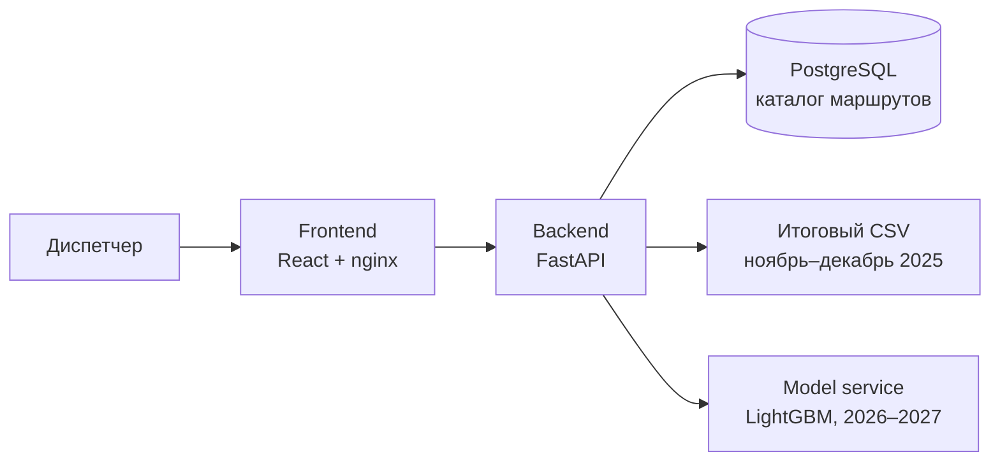

# Прогноз валидаций трамвайных маршрутов Москвы

**Рабочее место диспетчера с картой маршрутов, аналитикой и прогнозом пассажирских валидаций.** Веб-приложение показывает почасовой прогноз на день и подневный прогноз на месяц для девяти трамвайных маршрутов. Итоговый прогноз команды за ноябрь и декабрь 2025 года встроен в сервис; для дат 2026–2027 годов доступен отдельный режим инференса сохранённых LightGBM-моделей.

| 9 маршрутов в интерфейсе | 61 день итогового прогноза | 0,90461 на платформе | 80 RPS при p95 59 мс |
| :---: | :---: | :---: | :---: |
| Маршрутные ряды и карта | 1 ноября — 31 декабря 2025 | Для исходного файла с **10** маршрутами | Выдача готового прогноза, 2 vCPU |

> [!NOTE]
> Прогноз измеряется в **успешных пассажирских валидациях по маршруту**, а не в загрузке вагона. Числа для отдельных остановок пока не являются прогнозом валидаций. Область применения каждой метрики и ограничения подробно описаны ниже.

[Быстрый старт](#быстрый-старт) · [Возможности](#возможности) · [Модель и качество](#модель-и-качество) · [Архитектура](#архитектура) · [API](#api) · [Производительность](#производительность) · [Проверка проекта](#проверка-проекта)

## Быстрый старт

Нужен Docker Desktop или Docker Engine с Compose v2. Python и Node.js на компьютере для обычного запуска не требуются.

```bash
docker compose up -d --build --wait
```

Откройте **[http://localhost:5173](http://localhost:5173)**. Демо-вход: `dispatcher` / `tram2026`. При первом запуске Compose соберёт интерфейс, API и сервис модели, создаст PostgreSQL и заполнит каталог встроенными данными. Следующие запуски выполняются той же командой.

| Адрес | Назначение |
| --- | --- |
| [localhost:5173](http://localhost:5173) | Приложение для диспетчера |
| [localhost:8000/docs](http://localhost:8000/docs) | Интерактивная документация API |
| [localhost:8000/health/ready](http://localhost:8000/health/ready) | Готовность API и соединения с БД |

Для фона Яндекс Карт скопируйте `.env.example` в `.env`, заполните `VITE_YANDEX_MAPS_API_KEY` и пересоберите frontend командой `docker compose up -d --build --wait frontend`. Без ключа доступна схематическая карта. Ключ встраивается в браузерную сборку; ограничьте его по домену в кабинете Яндекса. `.env` исключён из Git.

## Возможности

| В интерфейсе | Что получает диспетчер |
| --- | --- |
| **Карта сети и маршрута** | Геометрия трамвайных линий из OpenStreetMap, переключение между маршрутом и сетью, фон Яндекс Карт при наличии ключа |
| **Прогноз на день и месяц** | Почасовой маршрутный ряд или суммы по дням, выбор периода и маршрута |
| **Аналитика** | График, таблица, сравнение маршрутов и рейтинг по прогнозному числу валидаций |
| **Экспорт** | CSV с выбранным прогнозом для дальнейшего анализа |
| **Карточка модели** | Версия, покрытие, опубликованные результаты проверки и происхождение данных без зашитых в интерфейс чисел |
| **Диспетчерский доступ** | Вход с токеном для защищённых запросов API |

Маршрутный прогноз за ноябрь–декабрь 2025 года берётся непосредственно из итогового файла команды. Для более поздних дат сервис модели строит новый прогноз по сохранённым бустерам. Оба режима возвращают единый контракт API, поэтому таблица, график, рейтинг и CSV работают с одними и теми же маршрутными рядами.

## Модель и качество

| Период | Как формируется ответ | Статус качества |
| --- | --- | --- |
| **01.11–31.12.2025** | Готовый итоговый почасовой прогноз из [`submission_final.csv`](tram_final/tram_final/outputs/submission_final.csv); месячный экран суммирует его по дням | Опубликован **платформенный score 0,90461** для исходного файла с 10 маршрутами, включая маршрут 5 |
| **01.01.2026–31.12.2027** | Инференс 15 сохранённых LightGBM-бустеров объёма и модели часового профиля; история заканчивается 31.10.2025 | Экстраполяция без проверки на фактических валидациях 2026–2027 годов; score итогового файла к ней не относится |

Сайт показывает девять маршрутов: **1, 7, 11, 12, 17, 25, 26, 28 и 50**. Маршрут 5 есть в исходном итоговом CSV, но исключён из текущей версии приложения. Отдельный score итогового файла по девяти отображаемым маршрутам не опубликован.

Для ML-гибрида есть временные бэктесты: **WAPE 8,8193%** на октябре 2025 года и **17,9045%** на сентябре–октябре 2025 года. Это проверка ML-гибрида с отсечкой обучения до тестового периода; она не является отдельным бэктестом финального ансамбля. Методика, артефакты и границы применимости описаны в [документе об интеграции](docs/tram-final-integration.md) и [исходном отчёте модели](tram_final/tram_final/README.md). Карточка модели доступна через `GET /model/metadata`.

> [!IMPORTANT]
> Маршрутные ряды помечены в API как `is_mock=false` и имеют единицу `validations`. Точки по остановкам служат для отображения схемы и помечены как `is_mock=true`, `value_unit=demo_index`; интерфейс не представляет их как пассажирские валидации. Годовой экран и достоверный прогноз по отдельным остановкам пока не реализованы.

## Архитектура



Compose запускает четыре постоянно работающих контейнера: `frontend`, `backend`, `db` и `model`. Сервис модели доступен только внутри сети Compose. Backend загружает итоговый CSV при старте, проверяет маршрут и границы периода, а для новых дат обращается к `model`. PostgreSQL хранит каталог маршрутов и остановок; запись прогнозного ряда доступна через отдельный метод API.

Код и артефакты модели лежат в `tram_final/tram_final/`, агрегированная история — в `data/labels/`. Сырые `data/train.csv` и `data/test.csv` (около 10 ГБ) не входят в Docker-образ и Git.

## API

Спецификация: [`docs/openapi.json`](docs/openapi.json). При запущенном сервисе доступен Swagger UI на [localhost:8000/docs](http://localhost:8000/docs). Защищённые методы требуют токен, полученный через `POST /auth/login`.

| Метод | Путь | Назначение |
| --- | --- | --- |
| `GET` | `/health/live`, `/health/ready` | Проверка процесса и готовности зависимостей |
| `POST` | `/auth/login` | Вход диспетчера |
| `GET` | `/routes`, `/routes/{route_id}/stops`, `/routes/{route_id}/geometry` | Каталог и геометрия |
| `GET` | `/forecast` | Маршрутный ряд на выбранный период |
| `POST` | `/forecast` | Расчёт и сохранение ряда в PostgreSQL |
| `GET` | `/forecast/map`, `/forecast/top-overload` | Точки карты и рейтинг |
| `GET` | `/model/metadata` | Карточка модели и результаты проверок |

Время передаётся в ISO 8601 со смещением, например `2025-11-01T08:00:00+03:00`. `forecast_origin` ограничивает запрошенный интервал и не запускает переобучение. У API сейчас нет endpoint для приёма потока новых событий валидации.

## Производительность

**Подтверждённый режим выдачи готового прогноза:** **80 RPS**, p95 **59 мс**, **0 ошибок**, **0 пропущенных итераций**. Дубликат backend работал с лимитом **2 vCPU / 2 ГиБ RAM**; CPU занимал **60–68% лимита**, память — **74–75 МиБ**. Тест выполнялся 27 сентября 2026 года с фиксированной интенсивностью k6 в течение 30 секунд.

| Нагрузка | Достигнуто | p95 | Ошибки / пропуски | Вывод |
| --- | ---: | ---: | ---: | --- |
| Готовый прогноз: 60 RPS | 59,96 RPS | 48 мс | 0 / 0 | Устойчивый режим |
| **Готовый прогноз: 80 RPS** | **79,94 RPS** | **59 мс** | **0 / 0** | **Устойчивый режим, CPU 60–68% лимита** |
| Готовый прогноз: 100 RPS | 96,03 RPS | 1 297 мс | 0 / 38 | CPU достиг лимита 2 vCPU |
| Готовый прогноз: 200 RPS | 92,76 RPS | 7 142 мс | 0 / 3 840 | Перегрузка |
| Новые, ранее не запрошенные даты: 2 RPS | 2,00 RPS | 203 мс | 0 / 0 | Пройдено через LightGBM |
| Разные будущие даты: 10 RPS | 7,25 RPS | 8 556 мс | 0 / 24 | ML-инференс ограничивает пропускную способность |

Таким образом, быстрый путь выдачи готового прогноза уже работает с запасом по CPU на 80 RPS. **Общее требование «сотни RPS при p95 < 200–300 мс в одном контейнере» пока не выполнено:** при 100 RPS возникает перегрузка, новые даты требуют отдельного ML-контейнера, а потоковый приём событий в API отсутствует. Эти выводы относятся к измеренным сценариям и не смешивают время ответа готового прогноза с временем нового инференса.

<details>
<summary>Условия теста и повторение замеров</summary>

Дубликат backend был запущен отдельно от рабочего контейнера, на `127.0.0.1:8001`, с `--cpus 2 --memory 2g --memory-swap 2g`. Для теста в нём отключили авторизацию; PostgreSQL и `model` оставались общими с исходным Compose. Генератор k6 работал в отдельном контейнере. Один запрос возвращал один часовой прогноз `demo-1`; проверялись HTTP 200, `is_mock=false` и наличие значения. Целевые пороги: p95 < 300 мс, ошибок < 1%, пропусков 0. Прогон 200 RPS длился 40 секунд, остальные — 30 секунд. Короткие прогоны не подтверждают долгосрочную стабильность RAM. После прогонов `memory.swap.current` был 0 у backend и model.

Сценарий: [`bench/forecast.k6.js`](bench/forecast.k6.js). Сырые итоги: [80 RPS](bench/archive-80.json), [100 RPS](bench/archive-100.json), [200 RPS](bench/archive-200.json), [новые даты 2 RPS](bench/future-cold-2.json), [разные будущие даты 10 RPS](bench/future-mixed-10.json). Замеры CPU и памяти находятся рядом с файлами JSON в `bench/`.

После `docker compose up -d --build --wait` из корня репозитория создайте `.env` из `.env.example`, если его ещё нет, и выполните:

```bash
docker build -f backend/Dockerfile -t hackaton-asumadi-bench-backend:local .
docker run -d --name hackaton-asumadi-bench-backend --network hackaton_asumadi_default --cpus 2 --memory 2g --memory-swap 2g --env-file .env -e CATALOG_BACKEND=postgres -e DB_HOST=db -e DB_PORT=5432 -e MODEL_SERVICE_URL=http://model:8080 -e AUTH_ENABLED=false -p 127.0.0.1:8001:8000 hackaton-asumadi-bench-backend:local
docker run --rm --network hackaton_asumadi_default -v "${PWD}/bench:/bench" -e BASE_URL=http://hackaton-asumadi-bench-backend:8000 -e WORKLOAD=archive -e RATE=80 -e DURATION=30s grafana/k6:latest run /bench/forecast.k6.js
```

Для новых дат используйте `WORKLOAD=future-cold` и `RATE=2`. Повторный прогон тех же дат уже измерит прогретый кэш. Нагрузка задаётся по [методике k6](https://grafana.com/docs/k6/latest/testing-guides/api-load-testing/) с [порогами p95 и ошибок](https://grafana.com/docs/k6/latest/using-k6/thresholds/); CPU и RAM считываются через [`docker stats`](https://docs.docker.com/reference/cli/docker/container/stats/). В Docker 100% CPU означает одно ядро, поэтому 200% для backend здесь соответствует лимиту двух ядер.

</details>

## Проверка проекта

Последняя проверка: **115 backend-тестов**, **17 frontend-тестов**, production-сборка frontend прошли успешно.

После установки `backend/requirements-dev.txt`:

```bash
cd backend && python -m pytest -q
```

После `npm ci` в каталоге `frontend/`:

```bash
npm test
npm run build
```

Для состояния и журналов контейнеров:

```bash
docker compose ps
docker compose logs -f backend
docker compose logs -f model
docker compose down   # остановка без удаления данных PostgreSQL
```

Служебный импорт архивного расписания запускается отдельно: `docker compose --profile tools run --rm schedule-import`.

## Состав репозитория

| Каталог | Содержимое |
| --- | --- |
| `frontend/` | Интерфейс React, карта, аналитика и экспорт CSV |
| `backend/` | FastAPI, авторизация, контракт прогноза и тесты |
| `model_service/` | Сервис LightGBM-инференса для новых дат |
| `tram_final/tram_final/` | Исходники конвейера, модели и итоговый CSV |
| `data/labels/` | Агрегированная история валидаций |
| `db/` | Схема, начальные данные и утилиты PostgreSQL |
| `docs/` | OpenAPI и описание интеграции модели |
| `bench/` | Сценарий нагрузки и результаты измерений |

Демо-учётная запись в `mock_data/dispatchers.json` предназначена для локального запуска.

## Ограничения и дальнейшие планы

Сейчас подтверждённый прогноз валидаций доступен **по маршруту**: итоговый результат покрывает ноябрь–декабрь 2025 года, а прогноз на 2026–2027 годы ещё не проверен на фактических данных. Числа по остановкам остаются демонстрационными; годовой режим и приём потока новых валидаций не реализованы. Замер 80 RPS относится к выдаче готового прогноза, а не к новому ML-инференсу или всей системе в одном контейнере.

Следующие шаги:

1. Подключить поток новых валидаций и регулярно сверять прогноз с фактом на новых периодах.
2. Ускорить инференс и работу API с каталогом, затем повторить длительный нагрузочный тест с авторизацией и изолированными зависимостями.
3. При появлении достаточных данных обучить и проверить прогноз по остановкам и расширить интерфейс до годового горизонта.
