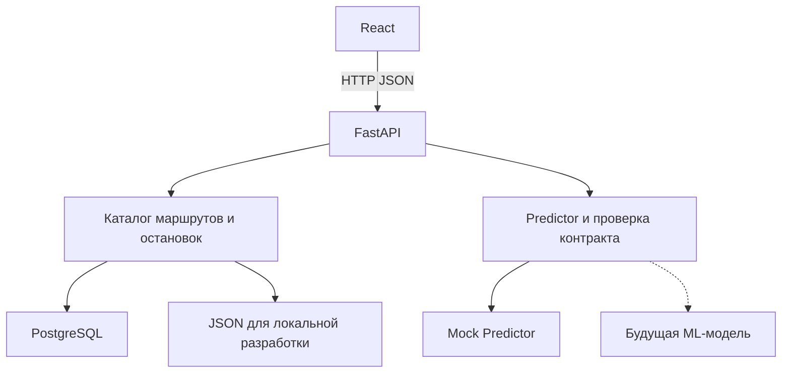

# Архитектура MVP и контракт ML ↔ Backend

Версия контракта: **1.0**. Состояние: стартовая реализация задач `[P0][ARCH]` и `[P0][DEV]`, 11 сентября 2026 года. Это внутреннее техническое решение команды для подготовки; официальный target и требования к данным ещё не определены.

## 1. Цель и границы

Подготовить продуктовый каркас, в котором источник прогнозов заменяется без изменения frontend и HTTP-контракта. До получения датасета используется синтетический показатель `predicted_load`. После получения данных отдельный адаптер преобразует выход модели в тот же контракт.

Предметная цель — поддержка решений диспетчера по ожидаемому пассажиропотоку трамваев. Значения mock не являются числом пассажиров, процентом заполнения или подтверждённой перегрузкой. Действия по распределению подвижного состава остаются за диспетчером.

В задачи 1–2 входят структура репозитория, API-контракт, заменяемый провайдер, запускаемые backend и frontend, минимальные справочники и конфигурация Compose. Карта, аналитические графики, Top-N, реальная модель и промышленный ETL относятся к следующим задачам.

## 2. Компоненты



JSON-каталог и PostgreSQL — альтернативные режимы каталога. Mock и реальная модель — альтернативные реализации `Predictor`. Стрелки к альтернативам не означают одновременного обращения ко всем источникам.

| Компонент | Ответственность | Граница |
|---|---|---|
| React | Параметры запроса, состояния загрузки и ошибки, отображение `ForecastResponse` | Не знает исходные колонки, формат модели или способ расчёта |
| FastAPI | Валидация HTTP, проверка route/stop/direction, вызов провайдера, контроль ответа | Не получает DataFrame или массивы NumPy |
| Catalog | Справочник маршрутов и упорядоченных остановок | Не вычисляет прогноз |
| PostgreSQL | Справочники; подготовлена таблица прогнозов для следующего этапа | Не используется как обязательное хранилище всех raw-событий |
| Predictor | `predict(ForecastRequest) -> ForecastResponse` | Единственная граница интеграции модели |
| Mock Predictor | Воспроизводимые данные для проверки интеграции | Не используется для оценки ML-качества |

FastAPI, каталог и провайдер работают в одном Python-процессе. Каждый провайдер создаётся один раз при старте приложения. Вариант с отдельным ML-сервисом допустим позже: Python-адаптер выполнит его вызов, сохранив этот интерфейс. Микросервисы для стартового этапа не требуются.

## 3. Сущности

| Сущность | Ключевые поля | Смысл |
|---|---|---|
| Route | `id`, `name`, `color` | Маршрут с непрозрачным строковым ID |
| Stop | `id`, `name`, `lat`, `lon` | Остановка, координаты WGS84 в градусах |
| RouteStop | `route_id`, `stop_id`, `sequence`, `direction_id` | Вхождение остановки в маршрут; одна остановка может встречаться несколько раз |
| SeriesKey | `route_id`, `stop_id?`, `direction_id?` | Идентичность прогнозируемого ряда |
| ForecastRequest | SeriesKey, `horizon`, `from`, `to`, `forecast_origin?` | Временной срез одного ряда |
| ForecastPoint | `timestamp`, `predicted_load`, `lower_bound?`, `upper_bound?` | Одна точка временного ряда |
| ForecastResponse | SeriesKey, `horizon`, `points[]`, метаданные | Прогноз одного ряда за выбранный период |

`route_id`, `stop_id` и `horizon` находятся на уровне ответа и относятся ко всем `points`. Они не дублируются в каждой точке JSON. В таблице `forecasts` каждая запись плоская и содержит все семь полей из задачи: `route_id`, `stop_id`, `timestamp`, `horizon`, `predicted_load`, `lower_bound`, `upper_bound`.

`stop_id = null` означает прогноз уровня маршрута. Это не сумма остановок по умолчанию. `direction_id = null` означает ряд без разделения направлений, а `0`/`1` — явно выбранное направление. Агрегацию реальных данных должен определить поставщик модели после уточнения target; UI и backend не выводят её автоматически из идентификаторов.

## 4. Время и горизонты

Все входные даты содержат часовой пояс: ISO 8601 с `Z` либо смещением. Backend приводит их к `Europe/Moscow` и возвращает UTC+3. Даты без часового пояса отклоняются. PostgreSQL использует `timestamptz`.

Интервал полуоткрытый: **`[from, to)`**. `timestamp` — начало интервала точки; конец равен следующему шагу сетки. `from` и `to` обязаны совпадать с границами сетки. Точки идут строго по возрастанию, без повторов и пропусков.

| `horizon` | Максимальная дальность от `forecast_origin` | `resolution` | Границы `from` и `to` | Полный пример |
|---|---|---|---|---|
| `day` | 1 день | `PT1H` | Начало часа | 24 точки за сутки |
| `month` | 1 календарный месяц | `P1D` | Полночь по Москве | 28–31 точка за полный календарный месяц |
| `year` | 12 календарных месяцев | `P1M` | Первое число месяца в полночь | 12 точек за год |

Разрешён непустой подынтервал горизонта. Месяц не приравнивается к 30 дням, год — к 365 дням. При прибавлении месяца несуществующий день заменяется последним днём соответствующего месяца. Эти шаги выбраны для каркаса и не выдаются за официальную гранулярность датасета.

`forecast_origin` — момент, из которого делается прогноз. Он не позже `from`; `to` не выходит за выбранный горизонт от него. При отсутствии `forecast_origin` используется `from`. Для реального backtest origin следует передавать явно и проверять доступность входных данных на этот момент. Заранее известный календарь будущих дат допустим; фактически наблюдённые позже значения target или телематики недопустимы как вход для такого прогноза.

## 5. Поля ответа

| Поле | Тип | Правило |
|---|---|---|
| `contract_version` | string | `"1.0"` |
| `series_key.route_id` | string | Совпадает с запросом |
| `series_key.stop_id` | string или null | Совпадает с запросом, включая null |
| `series_key.direction_id` | 0, 1 или null | Совпадает с запросом |
| `horizon` | `day` / `month` / `year` | Совпадает с запросом |
| `resolution` | `PT1H` / `P1D` / `P1M` | Соответствует выбранному горизонту |
| `forecast_origin` | timestamp | Совпадает с нормализованным запросом |
| `value_unit` | string | В mock — `demo_index`; реальная единица будет определена по данным |
| `aggregation` | string | `demo_mean`, `sum`, `mean`, `max` или `last`; правило значения внутри временного интервала |
| `is_mock` | boolean | Отделяет синтетические данные от реальных прогнозов |
| `model_version` | string | Идентификатор версии провайдера или обученного артефакта |
| `interval_level` | number или null | Заявленный уровень интервала в (0,1), либо null, если не определён |
| `points[].timestamp` | timestamp | Начало интервала на согласованной сетке |
| `points[].predicted_load` | number | Конечное неотрицательное число |
| `points[].lower_bound` | number или null | Нижняя граница |
| `points[].upper_bound` | number или null | Верхняя граница |

Неотрицательность — принятое для MVP ограничение показателя нагрузки. Если официальный target окажется иной величиной, это решение пересматривается явно. Имя поля остаётся нейтральным, но само по себе не заменяет определения единиц и агрегации.

Обе границы либо числовые, либо `null`. Если они есть: `0 <= lower_bound <= predicted_load <= upper_bound`. Если `interval_level` задан, границы должны быть у каждой точки. `NaN` и бесконечности запрещены. Отсутствие прогноза не обозначается нулём: неполный результат провайдера отклоняется.

У mock границы иллюстративные, `interval_level = null`: это не калиброванный интервал с заявленным покрытием. В разных горизонтах mock усредняет один и тот же часовой индекс по времени; пространственная согласованность сумм маршрутов и остановок не заявляется.

## 6. Request и response

Внутренний запрос к `Predictor` — объект `ForecastRequest`. Во внешнем API ему соответствует **GET `/forecast` с query-параметрами**, а не GET с JSON-телом. `from`/`to` — имена в JSON и URL; внутри Python используются `start`/`end`.

Пример внутреннего JSON-запроса на два часа:

<!-- REQUEST_EXAMPLE_START -->
```json
{
  "route_id": "demo-17",
  "stop_id": "demo-17-s01",
  "horizon": "day",
  "from": "2026-09-26T08:00:00+03:00",
  "to": "2026-09-26T10:00:00+03:00"
}
```
<!-- REQUEST_EXAMPLE_END -->

Ответ текущего mock-провайдера:

<!-- RESPONSE_EXAMPLE_START -->
```json
{
  "contract_version": "1.0",
  "series_key": {
    "route_id": "demo-17",
    "stop_id": "demo-17-s01",
    "direction_id": null
  },
  "horizon": "day",
  "resolution": "PT1H",
  "forecast_origin": "2026-09-26T08:00:00+03:00",
  "value_unit": "demo_index",
  "aggregation": "demo_mean",
  "is_mock": true,
  "model_version": "mock-v0",
  "interval_level": null,
  "points": [
    {
      "timestamp": "2026-09-26T08:00:00+03:00",
      "predicted_load": 58.5,
      "lower_bound": 49.73,
      "upper_bound": 67.27
    },
    {
      "timestamp": "2026-09-26T09:00:00+03:00",
      "predicted_load": 51.03,
      "lower_bound": 43.38,
      "upper_bound": 58.68
    }
  ]
}
```
<!-- RESPONSE_EXAMPLE_END -->

Проверка того же запроса через HTTP из корня репозитория:

```bash
curl --get "http://127.0.0.1:8000/forecast" --data-urlencode "route_id=demo-17" --data-urlencode "stop_id=demo-17-s01" --data-urlencode "horizon=day" --data-urlencode "from=2026-09-26T08:00:00+03:00" --data-urlencode "to=2026-09-26T10:00:00+03:00"
```

Для Windows PowerShell используйте `curl.exe`. `--data-urlencode` сохраняет `+03:00`: неэкранированный плюс в query может интерпретироваться как пробел. Необязательные `stop_id` и `direction_id` в URL просто отсутствуют; строки `null` и `optional` не являются специальными значениями.

Машинные артефакты:

- [JSON request](examples/forecast-request.json)
- [JSON response](examples/forecast-response.json)
- [JSON Schema request](contracts/forecast-request.schema.json)
- [JSON Schema response](contracts/forecast-response.schema.json)
- [OpenAPI snapshot](openapi.json)

Они генерируются из Pydantic и действующего провайдера командой `python backend/scripts/export_contract.py` из корня проекта с установленными backend-зависимостями.

## 7. HTTP API и ошибки

| Метод и путь | Поведение стартовой реализации |
|---|---|
| `GET /health` | 200 при доступном каталоге; PostgreSQL проверяется запросом `SELECT 1` |
| `GET /health/live` | 200, если процесс FastAPI работает; не обращается к БД |
| `GET /health/ready` | readiness-проверка каталога; PostgreSQL проверяется запросом `SELECT 1` |
| `GET /routes` | Список условных маршрутов |
| `GET /routes/{route_id}/stops` | Остановки с `sequence` и `direction_id`, отсортированные по направлению и порядку |
| `GET /forecast` | Проверенный `ForecastResponse` одного ряда |
| `GET /docs` | Swagger UI |
| `GET /openapi.json` | Актуальная машинная спецификация |

`/health` сохранён как alias `/health/ready`, чтобы выполнить исходный контракт карточки. В режиме `memory` readiness честно возвращает `database: "disabled"`; в режиме PostgreSQL — `database: "ok"`. Отдельный `/health/live` позволяет отличить сбой процесса от недоступности зависимости. Healthcheck не оценивает качество модели и не обучает её.

| HTTP | `error.code` | Ситуация |
|---|---|---|
| 422 | `VALIDATION_ERROR` | Неизвестное поле, неверная дата, сетка, диапазон или enum |
| 404 | `NOT_FOUND` | Нет маршрута, направления либо остановки на выбранном маршруте |
| 502 | `INVALID_PREDICTION` | Провайдер нарушил схему, ключ ряда или временную сетку |
| 503 | `DATABASE_UNAVAILABLE` | БД недоступна |
| 503 | `PREDICTOR_UNAVAILABLE` | Провайдер не смог выполнить расчёт |
| 500 | `INTERNAL_ERROR` | Непредвиденная ошибка сервера |

Общая форма ошибки: `{"error":{"code":"...","message":"...","details":[]}}`. Она применяется также к системным HTTP-ошибкам, включая неверный метод. Ошибки валидации включают положение проблемного поля. Детали подключения, traceback, пароль БД и внутренние данные модели в ответ не включаются. Вызовы модели синхронные; HTTP-обработчик `def` выполняется FastAPI в пуле потоков. Долгое обучение внутри запроса не допускается; тяжёлый inference и лимиты времени станут отдельным решением при появлении модели.

Конфигурация FastAPI и PostgreSQL загружается один раз в `Settings`. Некорректные enum, уровни логирования, порты и таймауты приводят к явной ошибке запуска. `PostgresCatalog` получает уже проверенные параметры через внедрение зависимостей конфигурации и не читает окружение самостоятельно.

`/forecast/map`, `/forecast/top-overload`, `/routes/{id}` и `/stops/{id}` описаны как будущие возможности в контексте проекта, но не реализованы в этих двух задачах. Назначать им фиктивные успешные ответы нельзя.

## 8. Замена провайдера

Контракт Python определён в `backend/app/predictors/base.py`:

```python
class Predictor(Protocol):
    def predict(self, request: ForecastRequest) -> ForecastResponse: ...
```

Переменная `PREDICTOR_FACTORY` указывает на фабрику `module:function`. Фабрика возвращает объект с `predict`, при необходимости загружая обученную модель один раз. Это серверная настройка, её нельзя задавать через пользовательский HTTP-запрос.

1. Текущий mock: `app.predictors.mock:build_predictor`.
2. Проверочный провайдер: `app.predictors.constant:build_predictor` — значение 42, обе границы null.
3. Будущий ML: например, `app.predictors.real:build_predictor`, когда такой модуль будет реализован. Сейчас его нет.

Для переключения меняется одна строка `.env` и перезапускается backend. При Compose применяется `docker compose up -d --force-recreate backend`. Пересборка frontend не требуется. Если добавляется новый Python-модуль в образ, backend нужно пересобрать.

Провайдер сам готовит необходимые признаки и преобразует выход модели в Pydantic. После него backend повторно проверяет схему, совпадение ключа, origin и полный временной ряд. Ошибка провайдера не приводит к незаметной подмене реальной модели mock-данными.

Для проверки заменяемости используются два разных провайдера и тот же HTTP-клиент; дополнительный тест подставляет провайдер с `is_mock: false` и иной единицей. Frontend читает метаданные и поддерживает null-границы.

## 9. Данные и запуск

- Локальный режим: Vite проксирует `/api/*` в FastAPI на порту 8000; каталог читается из `mock_data/catalog.json`.
- Compose: Nginx обслуживает сборку React и проксирует `/api/*`; FastAPI использует PostgreSQL, запускаемый раньше него по healthcheck.
- Начальные SQL-файлы и общий seed лежат в `db/`; начальная схема не является механизмом последующих автоматических миграций.
- Таблица `forecasts` подготовлена, но API пока не сохраняет прогнозы. Планируемый уникальный ключ включает ряд, timestamp, horizon, forecast_origin и model_version, чтобы не смешивать разные выпуски прогноза.
- `.env` не хранится в Git. В репозитории есть только `.env.example` с демонстрационными настройками.

## 10. Что уточняется после получения данных

Target и его единицы; различие validations/boardings/occupancy; привязка к остановке и направлению; временная гранулярность; метрика и временная схема проверки; смысл перегрузки и вместимость; доступные будущие признаки; правила пространственной агрегации; частота обновления и требования real-time; обязательность backend-стека.

Нейтральный контракт снижает объём переделок, но не гарантирует, что новые официальные требования никогда не потребуют его расширения. Изменения согласуются до интеграции. Ломающие изменения требуют новой версии контракта и обновления примеров, схем и проверок.

## 11. Основания решений

Стратегия и основной стек взяты из предоставленного `MT_Hackathon_2026_Project_Context(1).docx`, версия 1.0 от 11.09.2026. Шаги сетки, metadata, правила диапазонов и фабрика провайдера — конкретизация для задач 1–2.

Первичная техническая документация, использованная при реализации:

- [FastAPI — структура приложения](https://fastapi.tiangolo.com/tutorial/bigger-applications/)
- [FastAPI — внедрение зависимостей](https://fastapi.tiangolo.com/tutorial/dependencies/)
- [Vite — запуск и сборка](https://vite.dev/guide/)
- [Forecasting Principles and Practice — информация, доступная при прогнозировании](https://otexts.com/fpp3/forecasting-regression.html)
