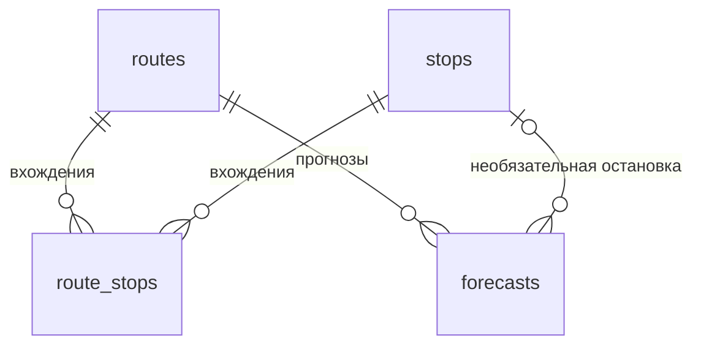

# PostgreSQL: схема, запуск и приёмка

Область: Trello `[P0][DB] Поднять PostgreSQL и спроектировать минимальную схему`.
Целевая версия — **PostgreSQL 16**, образ `postgres:16-alpine`.
Четыре таблицы описывают внутреннюю модель продукта, а не предполагаемую схему
датасета организаторов. Фактические результаты проверки: [db-verification.md](db-verification.md).

## 1. Назначение и связи



- Маршрут содержит упорядоченные вхождения остановок по направлениям.
- Остановка может принадлежать нескольким маршрутам и повторяться внутри одного.
- Прогноз всегда относится к маршруту. `stop_id = NULL` означает уровень маршрута.
- `direction_id = NULL` означает прогноз без разделения направлений; `0` и `1`
  обозначают направления внутри выбранного маршрута, а не стороны света.
- `predicted_load` пока нейтрален. Demo-индекс не является количеством пассажиров,
  occupancy или процентом заполнения вагона.

### Граница проверки целостности

БД проверяет существование `route_id` и непустого `stop_id` через внешние ключи.
**Принадлежность остановки выбранному маршруту/направлению сейчас проверяется
в backend перед вызовом predictor. На уровне БД это сочетание не защищено.**
Прямая запись SQL в `forecasts` может связать существующие, но несовместимые объекты.
При реализации сохранения прогнозов все пути записи, включая импорт от ML, должны
проверять соответствующее вхождение в `route_stops` либо получить отдельное
согласованное ограничение БД. Проверка только существования ID недостаточна.

Это явно зафиксированная граница P0-схемы. Не добавляем уникальность
`(route_id, stop_id, direction_id)`: она запретила бы допустимые повторные посещения.
Ряд текущего контракта относится к остановке, а не к отдельному её посещению.
Детализация по посещениям потребует изменения контракта.

Внешние ключи используют стандартный `NO ACTION`: удалить справочный объект,
пока на него ссылаются строки, нельзя. Каскадное удаление прогнозов не включено.

## 2. Таблицы и поля

Источник SQL: [001_initial.sql](../db/migrations/001_initial.sql).
Идентификаторы справочников — `text`, например `demo-17`. Переход на UUID сейчас
не требуется. Реальные внешние ID позднее сопоставляются внутренним отдельно.

### routes

| Поле | Тип | Правило |
|---|---|---|
| `id` | text | Первичный ключ |
| `name` | text | Обязательно, название маршрута |
| `color` | text | Обязательно, цвет; формат строки БД дополнительно не проверяет |

### stops

| Поле | Тип | Правило |
|---|---|---|
| `id` | text | Первичный ключ |
| `name` | text | Обязательно, название остановки |
| `lat` | double precision | Обязательно, широта от −90 до 90 |
| `lon` | double precision | Обязательно, долгота от −180 до 180 |

Координаты — WGS84, градусы. PostGIS для этой карточки не требуется.

### route_stops

| Поле | Тип | Правило |
|---|---|---|
| `route_id` | text | Обязательно, FK → `routes.id` |
| `stop_id` | text | Обязательно, FK → `stops.id` |
| `sequence` | integer | Обязательно, порядок начиная с 0 |
| `direction_id` | smallint | Обязательно, 0 или 1 |

Первичный ключ: **`(route_id, direction_id, sequence)`**. Он запрещает две остановки
на одной позиции одного направления, но допускает повторное посещение остановки.
Непрерывность нумерации и минимум остановок на маршруте не проверяются SQL.

### forecasts

| Поле | Тип | Правило / смысл |
|---|---|---|
| `id` | bigint, identity | Автоматический первичный ключ; вручную не передаётся |
| `contract_version` | text | Обязательно, по умолчанию `1.0` |
| `route_id` | text | Обязательно, FK → `routes.id` |
| `stop_id` | text, NULL | FK → `stops.id`; NULL — прогноз маршрута |
| `direction_id` | smallint, NULL | 0, 1 или без разделения направлений |
| `timestamp` | timestamptz | Обязательно, начало прогнозируемого интервала |
| `horizon` | text | Обязательно: `day`, `month`, `year` |
| `resolution` | text | Обязательно: `PT1H`, `P1D`, `P1M` соответственно |
| `forecast_origin` | timestamptz | Обязательно, момент, из которого построен прогноз |
| `predicted_load` | double precision | Обязательно, конечное число ≥ 0 |
| `lower_bound` | double precision, NULL | Нижняя граница интервала |
| `upper_bound` | double precision, NULL | Верхняя граница интервала |
| `value_unit` | text | Обязательно, единица показателя, задаётся поставщиком прогноза |
| `aggregation` | text | Обязательно: `demo_mean`, `sum`, `mean`, `max`, `last` |
| `is_mock` | boolean | Обязательно, синтетический ли это прогноз |
| `model_version` | text | Обязательно, версия поставщика прогноза |
| `interval_level` | double precision, NULL | Уровень интервала, строго между 0 и 1 |

Дополнительные ограничения:

- `forecast_origin <= timestamp`.
- `day → PT1H`, `month → P1D`, `year → P1M` — соглашение подготовительного MVP.
- Границы либо обе NULL, либо `0 <= lower_bound <= predicted_load <= upper_bound`.
  Верхняя граница должна быть конечной.
- Непустой `interval_level` допустим только с обеими границами. Границы без уровня разрешены.
- Комбинация `(route_id, stop_id, direction_id, timestamp, horizon, forecast_origin,
  model_version)` уникальна. `NULLS NOT DISTINCT` защищает от дублей также прогнозы
  без остановки/направления. Другой origin или версия модели допускают отдельную запись.

`timestamptz` хранит момент времени, а не исходное написание смещения.
`08:00+03:00` и `05:00Z` — один момент. API возвращает московское время; SQL-клиент
отображает время в своём часовом поясе. Для отображения Москвы в psql:
`SET TIME ZONE 'Europe/Moscow';`.

Сетка, отсутствие пропусков и границы `[from, to)` проверяются контрактом backend.
БД не проверяет выравнивание timestamp по часам/дням/месяцам. Это предварительная
внутренняя модель, которую уточним после получения target.

### Индексы

- Первичные ключи всех четырёх таблиц создают уникальные индексы.
- `route_stops_lookup(route_id, stop_id, direction_id)` поддерживает поиск вхождений.
- Уникальное ограничение `forecasts` создаёт индекс идентичности выпуска прогноза.
- Индексы общего среза карты и Top-N добавляются после определения запросов этих API.
  В этой карточке их производительность не оценивается.

## 3. Подготовка компьютера

Все команды выполняются **из корня рабочей копии**, где одновременно находятся
`docker-compose.yml`, `backend/`, `db/` и `frontend/`.
Если вы распаковали ZIP и видите ещё одну папку с проектом внутри, сначала перейдите
в неё. Для Git используйте существующий клон команды; повторный `git init` не нужен.

Нужно установить и запустить Docker с Compose v2. На Windows/macOS обычно используется
Docker Desktop; на Windows должны быть выбраны Linux containers. Для проверки только
БД Python, Node.js, PostgreSQL и psql на компьютере устанавливать не требуется.
Первое скачивание `postgres:16-alpine` требует доступа к реестру образов.

Проверьте:

```bash
docker version
docker compose version
```

`docker version` должен показывать сведения о сервере Docker. Если виден только
клиент и ошибка соединения, сначала запустите Docker Desktop/службу Docker.

Создайте `.env`, **если его ещё нет**.

Windows PowerShell:

```powershell
if (-not (Test-Path .env)) { Copy-Item .env.example .env }
```

Linux/macOS:

```bash
test -f .env || cp .env.example .env
```

Для первого локального запуска можно оставить демонстрационные `POSTGRES_DB`,
`POSTGRES_USER`, `POSTGRES_PASSWORD` из примера. Для своей БД задайте собственный
пароль в `.env`. Скрипты автоматически используют настройки контейнера.
Не добавляйте `.env` в Git. `.env.example` содержит только демонстрационный шаблон.

В текущем Compose команды опубликован порт **`127.0.0.1:55432:5432`**.
Backend внутри Docker использует `db:5432`. Для локального backend установите
`DB_PORT=55432` в `.env`; один лишь `.env` не изменяет фиксированную публикацию порта.
Если 55432 занят, измените только внешний порт в `services.db.ports` Compose и
укажите этот же номер в `.env` для локального backend. Внутренний порт остаётся 5432.

## 4. Первый запуск и проверка рабочей БД

Команды одинаковы для PowerShell и Linux/macOS:

```bash
docker compose up -d --wait db
docker compose ps db
docker compose exec -T db sh /opt/transport/db/scripts/manage.sh status
docker compose exec -T db sh /opt/transport/db/scripts/manage.sh check
```

После каждой команды дождитесь завершения. Если она сообщает об ошибке, переходите
к разделу 9, а не продолжайте следующие шаги вслепую.

Ожидается:

1. Сервис `db` запущен и имеет статус `healthy`.
2. `status` показывает PostgreSQL 16 и четыре таблицы.
3. На **новой** БД: `routes=3`, `stops=24`, `route_stops=48`, `forecasts=0`.
   Ноль прогнозов ожидаем: наполнение demo-прогнозами — следующая карточка Trello.
4. `check` выводит сообщения `PASS`, затем `ROLLBACK` и `DB_CHECK_OK`.

Код завершения последней команды:

```powershell
# PowerShell: выполнить сразу после команды проверки
$LASTEXITCODE
```

```bash
# Linux/macOS: выполнить сразу после команды проверки
echo $?
```

Успех — `0`. Проверка создаёт собственные строки и откатывает их; существующие данные
не изменяются. Счётчик identity может увеличиться после отката — пропуски ID допустимы.
На время проверки не запускайте параллельное изменение БД: приёмка рассчитана на
локальную разработку без конкурирующих записей.

## 5. Полная приёмка на пустой БД одной командой

Выполните из корня проекта:

```bash
docker compose -f db/compose.test.yml up --force-recreate --abort-on-container-exit --exit-code-from check
```

Это **отдельный Compose-проект `transport-db-check`**. Он не использует рабочую БД,
её volume и `.env`-учётные данные, не публикует порты. PostgreSQL хранит тестовые
данные во временной файловой системе; `--force-recreate` обеспечивает новую БД
при каждом прогоне. Не запускайте два таких прогона одновременно в одном Docker.

Сценарий проверяет:

- первую инициализацию официального образа: таблицы и справочный seed;
- два повторных применения SQL и seed: значения и количество строк не меняются;
- запись/чтение прогнозов и JOIN со справочниками;
- day/month/year, NULL-остановку, NULL-интервалы и часовой пояс;
- внешние ключи, удаление используемых справочников, координаты, порядок остановок;
- некорректные прогнозы, горизонты, интервалы и дубли, включая NULL-ключи;
- отсутствие тестовых строк после ROLLBACK.

Успех: `SEED_REPEAT_OK`, `DB_CHECK_OK`, `DB_ACCEPTANCE_OK` и код завершения `0`.
`--exit-code-from check` передаёт наружу код контейнера проверки. Прерывание Ctrl+C
не считается пройденной приёмкой: должны присутствовать все маркеры успеха.

После сохранения результата удалить контейнеры тестового проекта:

```bash
docker compose -f db/compose.test.yml down
```

Сохранность рабочего volume проверьте отдельно:

```bash
docker compose exec -T db sh /opt/transport/db/scripts/manage.sh status
docker compose restart db
docker compose up -d --wait db
docker compose exec -T db sh /opt/transport/db/scripts/manage.sh status
docker compose exec -T db sh /opt/transport/db/scripts/manage.sh check
```

Количество строк до и после перезапуска должно совпасть, проверка должна пройти.
Для отчёта сохраните вывод прогона и этих команд, версию Docker/Compose, дату и SHA
проверяемого коммита (`git rev-parse HEAD`).

## 6. Существующая БД и применение SQL

Первичная инициализация работает только при пустом volume. Обновление SQL в Git
и перезапуск контейнера сами по себе не изменяют существующую схему.

После получения этой доработки обновите конфигурацию контейнера, сохранив volume:

```bash
docker compose up -d --wait db
docker compose exec -T db sh /opt/transport/db/scripts/manage.sh migrate
docker compose exec -T db sh /opt/transport/db/scripts/manage.sh check
```

Compose применит новый bind mount `db/`, а существующие данные останутся в volume.
Если нужен повторный запуск текущего demo seed:

```bash
docker compose exec -T db sh /opt/transport/db/scripts/manage.sh seed
```

Seed использует upsert: обновляет демонстрационные ID, не удаляет другие записи.
Ручные изменения строк с такими же demo-ID будут заменены значениями seed.
Seed справочников пока не заполняет `forecasts`.

`migrate` — простой v0-runner: выполняет **все** `db/migrations/*.sql` по имени,
останавливаясь на первой ошибке. Журнал применённых версий он не ведёт.
Текущий `001_initial.sql` повторяемый и транзакционный. Он не изменяет структуру уже
существующих таблиц: `CREATE TABLE IF NOT EXISTS` не равен `ALTER TABLE`.

Для следующего изменения добавляйте новый нумерованный, повторяемый SQL с собственными
`BEGIN/COMMIT`, учитывающий сохранённые данные. Для автоматического применения на
новой БД подключите его также в `docker-entrypoint-initdb.d` **в обоих Compose-файлах**.
При появлении неповторяемых миграций сначала замените runner механизмом учёта версий.
Менять уже применённый `001_initial.sql` для обновления существующей БД нельзя.

Для обычного обновления не используйте `docker compose down -v`: эта команда
удаляет volume с данными. В приведённых инструкциях она не нужна.

## 7. Ручное знакомство со схемой

Откройте psql внутри контейнера (без `-T`, нужен интерактивный терминал):

```bash
docker compose exec db sh /opt/transport/db/scripts/manage.sh shell
```

Далее внутри psql:

```sql
\dt
\d routes
\d stops
\d route_stops
\d forecasts

SELECT r.id AS route_id, r.name AS route_name, rs.direction_id,
       rs.sequence, s.id AS stop_id, s.name AS stop_name
FROM routes r
JOIN route_stops rs ON rs.route_id = r.id
JOIN stops s ON s.id = rs.stop_id
ORDER BY r.id, rs.direction_id, rs.sequence;
```

Выход: `\q`. Проверки записи находятся в `db/tests/check.sql`; их запускает команда
`check`, вручную копировать многострочный SQL не требуется.

## 8. Подключение приложения

Для всей системы из корня:

```bash
docker compose up -d --build --wait
```

Откройте `http://localhost:8000/health`. Ожидаются `catalog_backend: "postgres"`
и `database: "ok"`. `database: "disabled"` означает JSON-каталог и не подтверждает БД.

Swagger: `http://localhost:8000/docs`; приложение: `http://localhost:5173`.
Текущий `/forecast` вычисляет результат адаптером и не сохраняет его в `forecasts`.
Это ожидаемое поведение каркаса, не ошибка DB-задачи.

Если приложения локальные, а БД в Docker, установите в `.env`
`CATALOG_BACKEND=postgres`, `DB_HOST=127.0.0.1` и выбранный внешний `DB_PORT`.
Команды Python/React находятся в [README](../README.md).
Настройки окружения применяются при перезапуске backend.

Остановка рабочей системы с сохранением данных:

```bash
docker compose down
```

## 9. Если запуск или тест не прошёл

| Симптом | Что делать |
|---|---|
| `docker` не найден | Установить Docker и открыть новый терминал |
| Нет соединения с Docker daemon | Запустить Docker Desktop/службу; проверить `docker version` |
| Неизвестен флаг `--wait` | Обновить Compose v2; временно использовать `up -d db` и дождаться `healthy` через `docker compose ps db` |
| Порт 55432 занят | Изменить внешний порт в `services.db.ports` Compose; тот же номер задать локальному backend через `.env`; выполнить `docker compose up -d --wait db` |
| Ошибка pull образа | Проверить доступ к реестру и повторить `docker pull postgres:16-alpine` |
| `db` unhealthy | Посмотреть `docker compose logs --tail=100 db`; исправить первую ошибку инициализации |
| `manage.sh` не найден | Проверить ветку/файлы и корень; выполнить `docker compose up -d --wait db` для применения mount |
| `relation ... does not exist` | Проверить логи; применить `manage.sh migrate`, затем seed при необходимости |
| Ошибка пароля после правки `.env` | Старый volume сохраняет прежние учётные данные; исправить настройки либо отдельно сменить пароль пользователя БД. Правка `.env` сама пароль не меняет |
| `DB_CHECK_FAILED` или ненулевой exit code | Сохранить первую ошибку, сверить SQL со схемой; карточку пока не закрывать |
| Lock timeout | Остановить параллельные записи и повторить на изолированном тестовом проекте |
| Backend возвращает 503 | Проверить `status`, настройки подключения и логи backend |
| Shell сообщает о `\r` | `.sh` должны иметь LF; `.gitattributes` задаёт этот формат при клонировании |

Не публикуйте `.env`. Перед передачей логов проверьте, нет ли в них вручную
добавленных строк подключения или паролей.

## 10. Критерии закрытия карточки

- [x] На машине участника PostgreSQL 16 запущен и имеет статус healthy.
- [x] Созданы четыре таблицы; SQL-проверка связей и ограничений завершилась `DB_CHECK_OK`.
- [x] Рабочая БД сохраняет данные после перезапуска.
- [x] SQL содержит четыре таблицы и внешние ключи.
- [x] Схема и команды описаны в `docs/db.md`.
- [x] Результат предоставленного участником Docker-прогона отражён в отчёте.

Основание: [отчёт с результатами участника](db-verification.md). Статус Trello
этими флажками автоматически не меняется. При отправке PR приложите вывод команд.
Изолированный прогон раздела 5 также подтверждён: `DB_ACCEPTANCE_OK`, код завершения 0.
Наполнение прогнозами, новые API и карта относятся к следующим задачам.

## Справочные источники

- [PostgreSQL 16: ограничения](https://www.postgresql.org/docs/16/ddl-constraints.html).
- [Образ PostgreSQL: первая инициализация](https://hub.docker.com/_/postgres).
- [Compose up: ожидание и коды завершения](https://docs.docker.com/reference/cli/docker/compose/up/).
