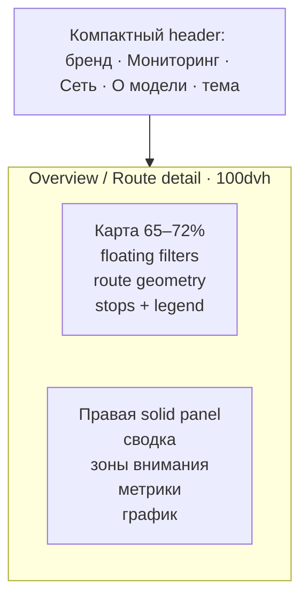
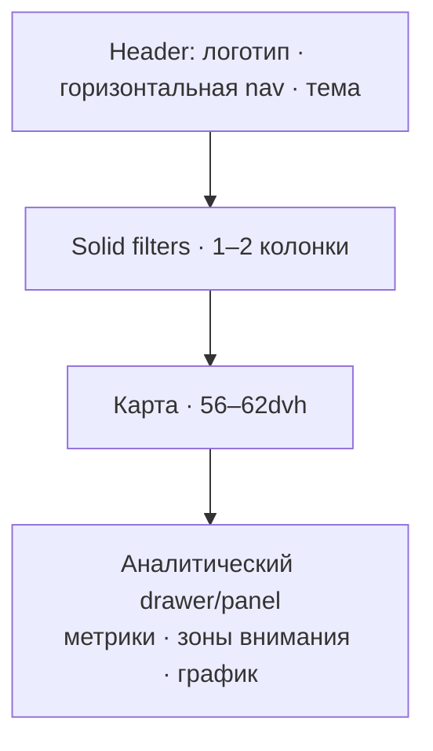

# Dispatcher UI: дизайн-система и схема экранов

Документ фиксирует реализуемую dark-first концепцию интерфейса. Визуальный подход
основан на принципах Vexto Telemetry — карта как рабочий canvas, высокая контрастность,
сдержанная палитра и короткие стеклянные контролы поверх карты — без копирования
композиции, бренда или графических материалов референса.

## 1. Принципы

1. **Карта — главный объект мониторинга.** На desktop она занимает около 70% ширины
   и всю доступную высоту первого экрана.
2. **Цвет сообщает состояние.** Нейтральные поверхности не конкурируют с нормальным,
   предупредительным и критическим статусами.
3. **Glass только над картой.** Фильтры, легенда и короткая подпись карты могут быть
   полупрозрачными. Таблицы, графики, длинные тексты и карточка модели используют
   сплошной фон.
4. **Dark — основная диспетчерская тема.** Light использует те же semantic tokens,
   поэтому компоненты не содержат отдельной «светлой» разметки.
5. **Сначала решение, затем детализация.** Маршрут выбирается на карте или в рейтинге,
   а аналитика открывается рядом, без отдельного многошагового сценария.

## 2. Desktop wireframe

Фильтры маршрута, участка, даты и horizon находятся в одной компактной glass-панели
над картой. Выбранный маршрут рисуется толстой цветной линией; контекст сети не должен
быть ярче выбранного объекта. Правая панель прокручивается независимо, поэтому базовая
работа с картой не создаёт вертикальный скролл всей страницы.

## 3. Поведение на узком экране

До 900 px фиксированная диспетчерская раскладка превращается в обычный документ:
фильтры идут перед картой, карта сохраняет приоритет по высоте, правая панель становится
нижней панелью. До 680 px текст wordmark скрывается, навигация прокручивается по горизонтали,
а пояснение карты сокращается. Touch-target — не менее 38–40 px.

## 4. Semantic tokens

Все значения находятся в `frontend/src/styles.css`. Компоненты используют назначение
цвета, а не конкретный hex.

| Группа | Tokens | Назначение |
| --- | --- | --- |
| Canvas | `--bg-canvas`, `--bg-canvas-soft`, `--nav-bg` | фон приложения, карты и навигации |
| Surface | `--surface`, `--surface-raised`, `--surface-muted`, `--surface-soft` | панели, карточки, таблицы |
| Glass | `--surface-glass`, `--surface-glass-strong` | только компактные элементы над картой |
| Text | `--text-primary`, `--text-secondary`, `--text-muted`, `--text-faint` | четыре уровня иерархии текста |
| Border | `--border-subtle`, `--border-strong` | разделители и границы контролов |
| Action | `--brand-control`, `--brand-control-hover`, `--link`, `--focus-ring` | кнопки, ссылки, keyboard focus |
| Status | `--status-normal`, `--status-attention`, `--status-critical` | рабочий, требующий внимания и критический статус |
| Chart | `--chart-grid`, `--chart-interval`, `--track` | сетка, доверительный интервал и треки |
| Geometry | `--radius-sm/md/lg`, `--shadow-sm/lg` | радиусы и глубина поверхностей |

Основные статусные цвета dark-темы: normal `#5EC557`, attention `#F39444`,
critical `#FF5A5F`. Они не используются как декоративная заливка больших площадей.

## 5. Типографика и ритм

- Основной стек: `Inter`, `Segoe UI`, системный sans-serif.
- Большие заголовки используются только на Home и About model. Рабочий экран применяет
  компактные заголовки и табличные цифры.
- Базовый шаг отступов: 4 px; рабочие значения 8, 12, 16, 24, 32 px.
- Радиусы: 8 px для контролов, 12 px для рабочих карточек, 18 px для крупных разделов.
- Длинный текст имеет solid surface и ограниченную длину строки.

## 6. Основные экраны

| Экран | Главная задача | Композиция |
| --- | --- | --- |
| Overview / Monitoring | увидеть сеть и выбранный маршрут | карта + floating filters + правая панель |
| Route detail | исследовать направление, участок, остановки и временной ряд | тот же workspace; аналитика меняется без лишнего перехода |
| Analytics | сравнить маршруты и зоны внимания | solid metrics, общая карта, рейтинги и таблицы |
| About model | объяснить target, данные, backtest и качество | model card, pipeline, метрики, ограничения и источники |

## 7. Состояния компонентов

| Состояние | Правило |
| --- | --- |
| Loading | сохраняет размеры блока; текстовый статус или skeleton без скачка layout |
| Error | critical surface + причина + действие «Повторить» |
| Empty | нейтральное объяснение, какие фильтры изменить |
| Selected | усиленная граница/фон и `aria-pressed`; цвет не является единственным признаком |
| Hover | изменение поверхности без смещения компонента |
| Focus | непрерывный контрастный outline `--focus-ring`, минимум 3 px |
| Disabled | меньшая контрастность, сохранённая читаемость и стандартный курсор |

## 8. Карты, графики и доступность

- Yandex Maps v3 получает `theme: dark/light` из темы приложения.
- При отсутствии API-ключа сохраняется явный fallback; ошибка не маскируется пустым canvas.
- Recharts использует tokens для сетки, осей, tooltip, прогноза и границ интервала.
- Контролы имеют `:focus-visible`; интерактивные линии fallback-карты доступны по Enter/Space.
- Учитывается `prefers-reduced-motion`.
- Выбор темы хранится в `localStorage`; первый запуск использует системное предпочтение,
  а при отсутствии светлого предпочтения открывается dark.

## 9. URL и производительность

Состояние мониторинга хранится в query parameters: `route`, `direction`, `from`, `to`,
`stop`, `horizon`, `date`, а для месячного режима — `dateFrom`, `dateTo`. Страница задаётся
hash (`#details`, `#analytics`, `#model`). Перезагрузка восстанавливает тот же контекст.

Запросы прогнозов уже отменяются через `AbortController`. Геометрия сети загружается
пакетами и кешируется; переключение темы пересоздаёт только слой карты, а не прогнозные
запросы. Новая страница модели выполняет один запрос `/api/model/metadata`.

## 10. Проверка перед merge

1. Dark/light на `#home`, `#details`, `#analytics`, `#model`.
2. Перезагрузка после переключения темы.
3. Desktop 1440×900 и узкий экран 390×844.
4. Keyboard-only: навигация, фильтры, календарь, линии fallback-карты, модалки.
5. Yandex Maps с ключом и fallback без ключа.
6. График, tooltip, таблицы, сортировка, modal и disabled-состояния в обеих темах.
7. В About model числа должны появляться только из утверждённого backend JSON и совпадать
   с командным отчётом.
